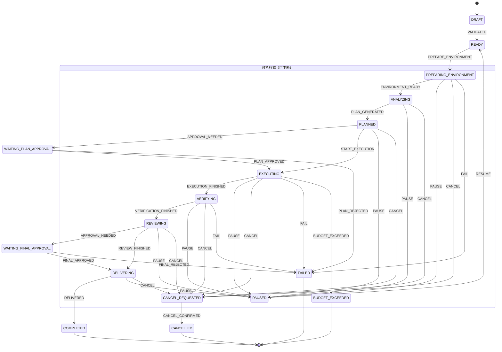

# STATE_MACHINE — ForgeFlow 任务状态机

> 目标：可单测、幂等、可持久化的状态机。所有转移由确定性代码执行（规格 §4：业务规则不依赖模型判断）。
> 里程碑：M2 落地 + 全路径单测；M5 增加审批相关转移。

## 状态机图（Mermaid）



> 注：中断态从任一**可执行态**进入；`RESUME` 需要恢复目标（`resume_target`，必须是可执行态）；同事件重复应用为幂等 no-op。

## 1. 状态集

### 主路径（按序）
```text
DRAFT → READY → PREPARING_ENVIRONMENT → ANALYZING → PLANNED
  → EXECUTING → VERIFYING → REVIEWING → DELIVERING → COMPLETED
```
- `PLANNED` 后可选进入 `WAITING_PLAN_APPROVAL`（是否进入由风险等级/仓库策略决定）。
- `REVIEWING` 后可选进入 `WAITING_FINAL_APPROVAL`。

### 终止态 / 异常态
```text
PAUSED · FAILED · CANCELLED · BUDGET_EXCEEDED
```
- `CANCEL_REQUESTED` 为中间态：收到取消请求后先进入，后台真正停止后再转 `CANCELLED`。
- `PAUSED` 可恢复：`PAUSED → READY`（重新准备）或回到暂停前状态（恢复 Checkpoint）。

## 2. 转移表（合法转移）

| 当前 → 下一 | 守卫 | 备注 |
|---|---|---|
| DRAFT → READY | 任务完整且策略校验通过 | 创建时自动 |
| READY → PREPARING_ENVIRONMENT | 环境后端可用 | |
| PREPARING_ENVIRONMENT → ANALYZING | 环境就绪 | |
| ANALYZING → PLANNED | 分析完成（结构化计划） | |
| PLANNED → WAITING_PLAN_APPROVAL | 策略要求计划审批（P1/高险） | 可选 |
| WAITING_PLAN_APPROVAL → EXECUTING | 计划已批准 | 拒绝 → FAILED 或 DRAFT |
| PLANNED → EXECUTING | 无需计划审批 / 已批准 | |
| EXECUTING → VERIFYING | 代码修改完成 | |
| VERIFYING → REVIEWING | 目标测试/静态检查完成 | 失败可回 EXECUTING（有限重试） |
| REVIEWING → WAITING_FINAL_APPROVAL | 策略要求最终审批 | 可选 |
| REVIEWING → DELIVERING | 门禁通过且无需最终审批 | |
| WAITING_FINAL_APPROVAL → DELIVERING | 最终批准 | 拒绝 → FAILED |
| DELIVERING → COMPLETED | 交付产物生成 | |

### 任意执行态 → 中断/异常
| 当前 → 下一 | 守卫 | 备注 |
|---|---|---|
| *执行态* → CANCEL_REQUESTED | 收到取消 | |
| CANCEL_REQUESTED → CANCELLED | 后台子进程已终止 | 真正停止后才置 CANCELLED |
| *执行态* → PAUSED | 暂停请求 | 保存 Checkpoint |
| PAUSED → <暂停前状态> | 恢复请求 | 校验 Checkpoint 有效 |
| *执行态* → FAILED | 不可恢复错误 | 记录原因与 Trace |
| *执行态* → BUDGET_EXCEEDED | 超出预算 | 保存现场，等待人工决定 |

## 3. 约束（规格 §5.1）

1. 非法转移：拒绝并记录审计事件（抛 `IllegalTransitionError`，写入 Trace）。
2. 幂等：同一命令重复执行不重复改变状态（转移函数对「当前态=目标态」幂等返回）。
3. 持久化：每次转移原子写入（`state` + `version`，乐观锁），服务重启可从最后持久化状态恢复。
4. 取消必须真正停止后台执行和子进程（`BackgroundTaskManager.stop_task`，`tasks/manager.py:49`）。
5. 非幂等工具失败后不得盲目重试（与预算/重试策略配合，规格 §11）。
6. 状态变化全部写审计事件（`TraceEvent`），不可静默覆盖。

## 4. 实现要点

- 状态机为**纯函数**：`transition(current, event, ctx) -> (next, side_effects)`，无 I/O；I/O 由调用方（orchestration_service）执行，便于单测。
- 转移表驱动：用字典/枚举定义合法转移与守卫，避免散落 if/else。
- 并发：单任务单进程执行（V1），状态更新用乐观锁版本号；M6 服务化后同任务写通过 DB 行锁/版本控制。
- 恢复：加载持久化状态 → 校验 Checkpoint（`ExecutionRun.checkpoint` + S4 SessionBackend）→ 恢复对应执行态。

## 5. 测试要求（M2 验收）

- 覆盖：正常路径全序列；计划审批分支；最终审批分支；取消（含中途取消）；暂停/恢复；非法转移拒绝；超预算；失败；恢复幂等。
- 每个测试断言：转移后的状态、审计事件、副作用集合。
